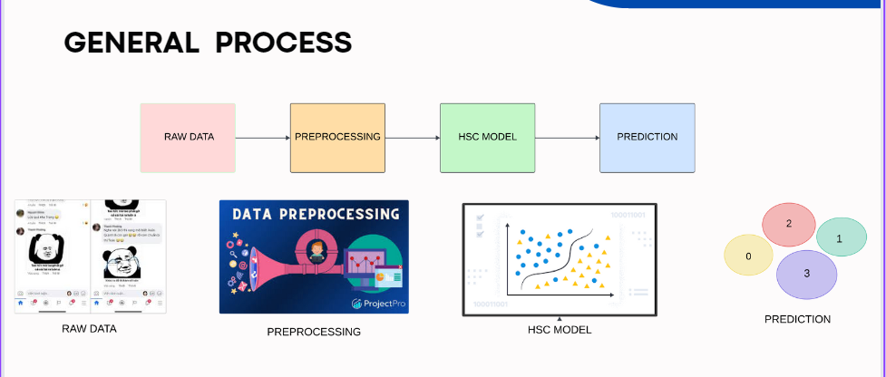
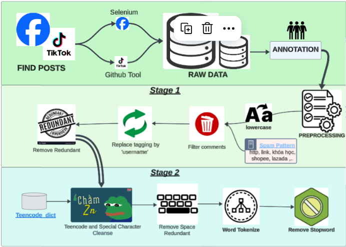

# NEGATIVE SOCIAL MEDIA COMMENTS CLASSIFICATION

Our project focuses on building an end-to-end system to automatically crawl Facebook comments data and classify them into four labels: Hate speech, Personal Attack, Discrimination, Others.

 ## Main Fuction 
- Scrape comments with related information such as: 
  - Comment - text 
  - User 
  - Nametag (like @name_tag) 
  - Check if it is spam (based on user-defined demand)  
  - Via ```https://github.com/boo283/Facebook_comment_crawler.git ```
- Preprocess data:
  - Follow these steps:
  
- Make classification and visualize the results:
  - Use HSD model (base on ML model) to predict
  - Visualize data using Streamlit 
  
## Installation
- Clone the repository
  ``` git clone https://github.com/boo283/Facebook_comment_crawler.git ```
  ``` git clone https://github.com/boo283/NEGATIVE-SOCIAL-MEDIA-COMMENTS-CLASSIFICATION.git```
- Install dependencies: 
 ``` pip install -r requirements.txt ```
 
 ## Usage
 1. Clone this repository 
 2. Open this repository and add some information: 
- Crawler
 - In folder "configuration":
   -  config.py:
      -    In function configure_driver(), replace by the path to your chrome driver, which could be download at
        ref: https://googlechromelabs.github.io/chrome-for-testing/#stable
 - In main folder: 
   - crawl.py:  
      - Just type your Facebook account in the Login info part in main function. 
      - Choose your destination to save crawled data 
- App.py:
  - Create kafka-topic "StreamComments"
  - Adjust paths in python files
 3. Cd to folder and run script: python app.py
 4. Simply enter the Facebook URL post, Account information and choose Featch and analyze


  ## Contact:    
  - LinkedIn: https://www.linkedin.com/in/phutrungnguyen283/ 
  - Facebook: https://www.facebook.com/ngphtrungboo 
  - Email: trung280302@gmail.com 
  
<strong> Feel free to adjust my code, practice makes perfect ❤️❤️❤️ <strong>
